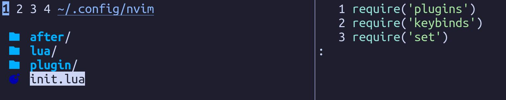
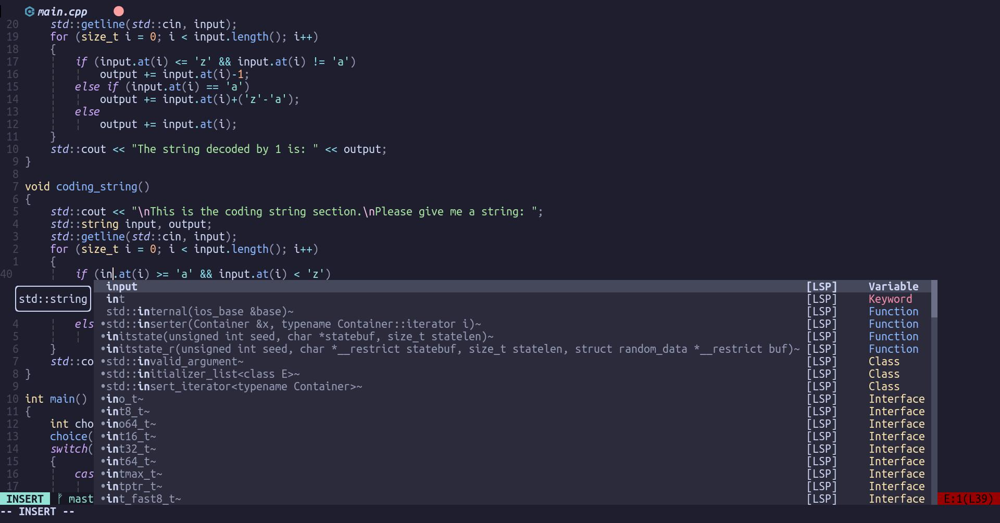
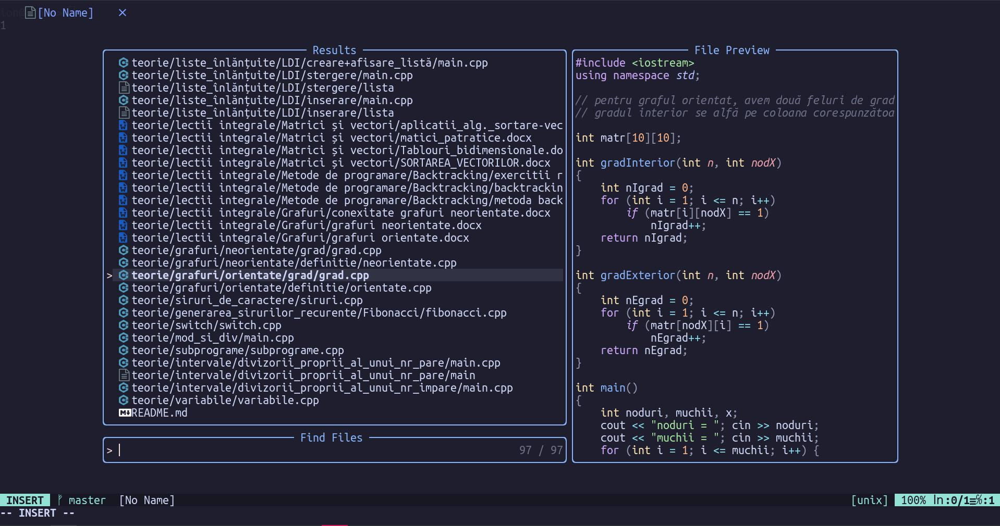

Hi! I've realized that, since my last configuration post, things have changed, quite a bit. I'd like to talk about them and some of the things that I still haven't ironed out yet. Let's begin!

First, my desktop environment: for a long time, I've used XFCE4 as my main DE. 
I've tried window managers like stock Openbox before, or desktop environments like GNOME or Cinnamon, but currently, KDE Plasma is the destkop environment I use.
XFCE still has a soft spot in my heart, but currently, Plasma is the best in-between for me. 
It has the fast performance when I want that and nice animations and eye candy when I want that. 
It has every feature I want/need and I think it's more feature rich than XFCE. Some might say too feature rich, but I somewhat like that. 
I don't think it is as polished as GNOME, for example the calculator apps (yes, apps, because KDE seems to have separated different types of calculators in different apps) are lacking compared to GMOME's calculator, but Plasma doesn't feel as restricted as GNOME, which is something I really like.
I would like to revisit GNOME some time later this year and lay down everything I like and don't about it.

Next, IDE: I've finally decided to move to Neovim completely.
I've redone my configuration files, based on [ThePrimeAgen's "0 to LSP" video (god bless the man).](https://youtu.be/w7i4amO_zaE) 
One problem I still have is that, compared to VSCode, Neovim doesn't have the nice debugger GUI VSCode has.
I might use VSCode from now on as a nice debugger, though I wonder if there are any plugins to make add debugger functionality in Neovim and make it work and look nicely.
I still have to learn how to use vim like how Vim Diesel does, but I will definitely go that path, only because I just enjoy it more.
I want to have the ability to be a coconut oiled jaguar while editing code. 

Let's go a bit through the configuration files for Neovim, actually.

Above is my `init.lua` file. In `plugins`, I've my plugins, of course. `keybinds` is where I put *some* of my prefered keybinds. In `set`, I've some basic editor settings.

For my plugin system, I use [`packer.nvim`](https://github.com/wbthomason/packer.nvim) now. 
A big difference between packer and vim-plug is that packer is written in Lua, configurated in Lua. 
I tried my best to use Lua for configurating everything and for the most part, I managed to do it.

The most important plugin that I've installed, in my opinion, is [`nvim-treesitter`](https://github.com/nvim-treesitter/nvim-treesitter). Treesitter is a code parser, among the fastest, to my knowledge. Treesitter used alongside a set of plugins named [`lsp-zero`](https://github.com/VonHeikemen/lsp-zero.nvim) add super nice syntax highlighting, code completion and code snippets as well.

Another plugin I really like is [`telescope.nvim`](https://github.com/nvim-telescope/telescope.nvim). This is a fuzzy finder for Neovim, made by, from what I know, a main contributor to Neovim. It is much more nicer than what I used before, which was [`fzf.vim`](https://github.com/junegunn/fzf.vim). It has a preview window for the code and works just as fast as fzf.

I can keep going, but it will take a long time, so I will stop myself here. Maybe I will do a full write up and the plugins I use.

Lastly, I want to touch on the new theme I've added for the website. 
For the past couple of weeks, I've worked on a big project for my school and I had to use Hugo to make a website for it.
I saw a lot of cool themes out there, that I felt like had more features than what [etch](https://github.com/LukasJoswiak/etch), the theme I used before, had.
I really liked etch for its minimal style, but it was somewhat featureless. 
For example, etch doesn't have can't add a favicon to your website from the config file, as far as I can tell.
I probably could have added that feature myself if I tried hard enough, but I kinda didn't want to do that, so I began searching for a theme.
I found [PaperMod](https://github.com/adityatelange/hugo-PaperMod) while scrolling through the themes and I really liked, and so I added it.
It has the same minimal style and has many other features, like the aforementioned favicon support from the config file.
I hope you guys like it!

That's it, really. 
I can't really think of anything else that I've changed. 
For the most part, things have staid the same. I'm hoping to write more about stuff soon. 
See ya!
