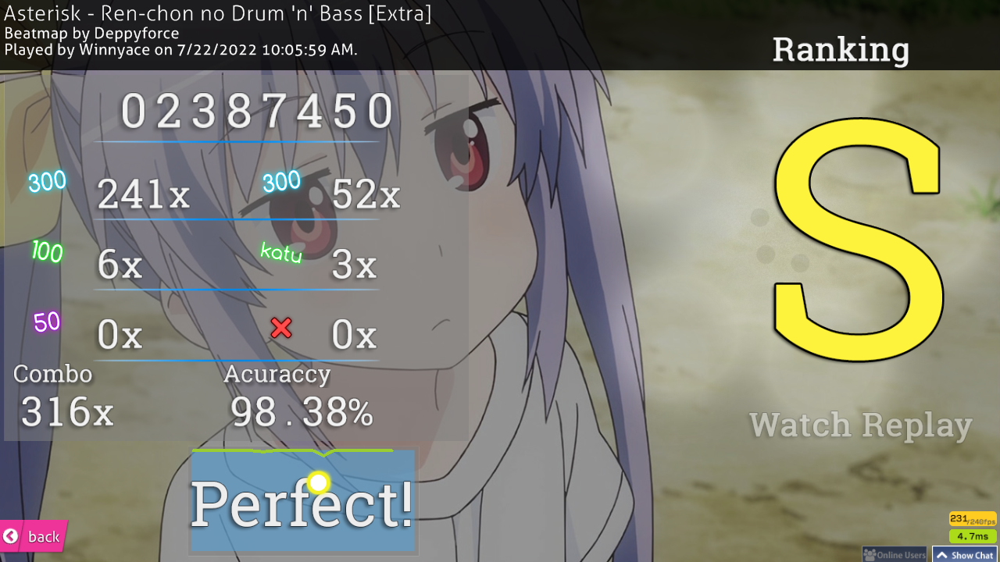
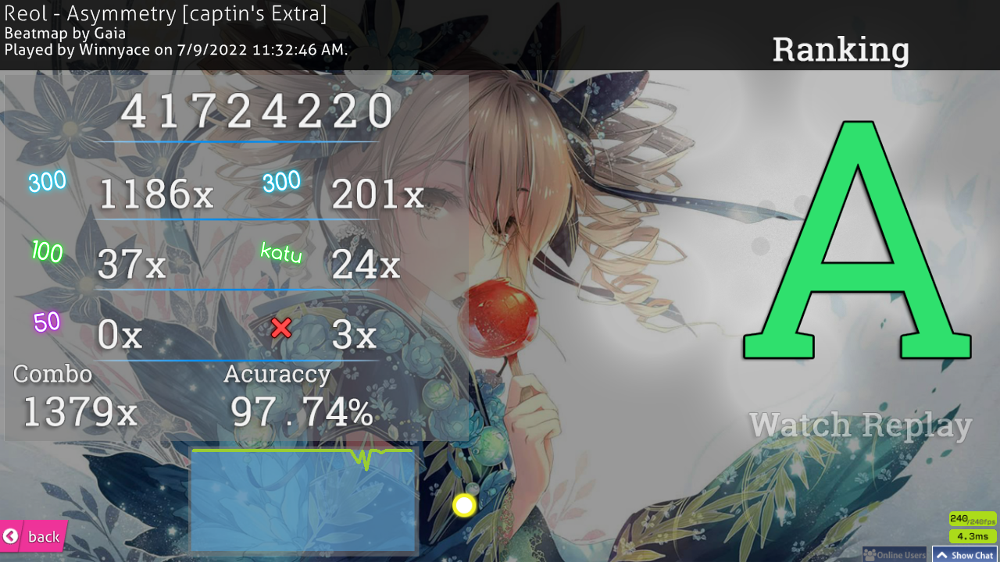

Hi! This is the second week of my osu! improvement journey some nice things have happened, but it's yet another, sort of, lazy week. Let's begin!

On Monday and Tuesday, I didn't play at all. no excuse, really. Just laziness.

On Wednesday, I played for the first time this week. it was pretty good day I got two HR scores.  Admittedly, they're quite  boring scores, but I think it's a step in the right direction when it comes to HR.  both are done on [Best FriendS by sahuang.](https://osu.ppy.sh/beatmapsets/748836#osu/1577478) What can I say? I like the song :D

[Click here for the first replay](https://odysee.com/$/embed/Best-FriendS-N-a-s-y-a%27s-Insane--%2BHR/8a5bd31f314b24076b2d13cede3a9cf97fb7650b?r=42PNMr5RuN12RUSUC17dRvdcy8EYov9h)

[Click here for the second replay](https://odysee.com/$/embed/Best-FriendS-Everlasting-Memories--%2BHR/7737f640a86e66b726a7b8dd8368441e988be3ca?r=42PNMr5RuN12RUSUC17dRvdcy8EYov9h)

I've also played a tech, I guess I can call it, map. It's a pretty fine score, I think.

I also got a score on a Non Non Biyori DNB Remix. It's a 54 seconds map, but has CS6 and it's a stream map. I'll take that.

I've also played a bit of DT on Hidamari Days. Below you've the score in video form.

[Click here for the replay](https://odysee.com/$/embed/Hidamari-Days-DT/13d54fe68d3bab94edac8d628c7d47c4506e7adc?r=42PNMr5RuN12RUSUC17dRvdcy8EYov9h)

Admittedly, these scores aren't something impressive, but I believe it's the step towards the right direction. by this time, I still haven't set a specific goal, however, that changed quickly.

On Thursday, I didn't play yet again.

On Friday, I played for a bit. Nothing much, however. I got a NoMod FC on Rave 2 Rave.

This song is jamming! Not my score, though. My accuracy is quite bad, not gonna lie.

On Saturday is when I finally got a goal: [FC Asymmetry by Gaia, captin's Extra difficulty.](https://osu.ppy.sh/beatmapsets/292077#osu/679779) The map is pretty bog standard these days, I believe, but it's a 6 star map, the song is pretty good, in my opinion, and I think I can get the FC. below you've the attempt I've done on Saturday.

[Click here for the replay](https://odysee.com/$/embed/Asymmetry-captin%27s-Extra--pass/c11bbdd290fbd9aef9726bca4b7c36000bbb7213?r=42PNMr5RuN12RUSUC17dRvdcy8EYov9h)

You probably saw that I've a 1000+ combo score on this already.

I set that score at beginning of this month. I've missed at the end, due to the pressure of that FC. This is something I will need to deal with. I panic when I'm close to getting a FC. I think everybody does, actually, but some keep their focus and pull through. I think I'll try to regulate my breathing when I'm close to getting the FC. I think that's the best solution. Trying to hyperfocus on the map will only result in bad things.

On Sunday, I didn't play.

This ends this week. I kinda want to play osu! right now, believe it or not. See ya next week!