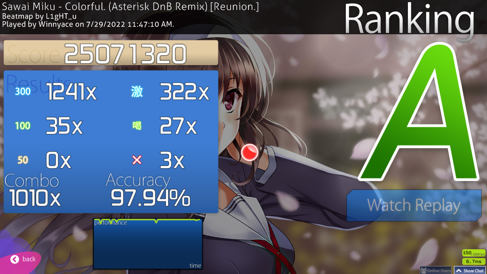

Towards the beginning of week 3, I got sick and I couldn't really play, which made me feel like these two weeks would be boring, but I got some pretty good scores overall, and I think I'm starting to go down the right path. let's begin with week 3. the only score worth noting here is a FC on an, at the time, newly ranked map of a Gochiusa song. it's a pretty bog standard map, but getting it was very rewarding. below you've the score.

[Click here for the replay](https://odysee.com/@winnyace:e/Shinsaku-no-Shiawase-wa-Kochira!-Cappucino-FC:1?r=42PNMr5RuN12RUSUC17dRvdcy8EYov9h) 

That happened on the 29th of July. Afterwards, nothing really happened. a bad thing I do a lot is giving up on a map after a mistake. that's something that hurts me, a lot, especially mentally. this game is very mental, I feel like. a lot of what I'm doing most of the time is fighting myself to keep going and finish the map. always finish the map... always. I didn't get anything done in that weekend. only thing I got was a new goal: FC [Colorful by L1gHT_u](https://osu.ppy.sh/beatmapsets/1567488#osu/). I got a pretty big combo on it already and I felt I could do it, but I got nothing going. 

 

On Monday, I made the previous blog post and played more Colorful. I still got nothing.

[Click here for the replay](https://odysee.com/$/embed/Colorful.-%28Asterisk-DnB-Remix%29-Reunion./0a897485feec80e2fa20437290d2bedc6b0de729?r=42PNMr5RuN12RUSUC17dRvdcy8EYov9h) 

Then on Tuesday, I began playing. It felt like yet another boring slog of a day with more Colorful attempts, until I began playing DT on the ED or OP, I don't really know for sure to be honest, for the Kill me baby anime, at least I think that's the name. I don't really know, all I know is that the song is jamming hard. I began putting some plays into it, going to the end and then... it happened... 

[Click here for the replay](https://odysee.com/$/embed/Futari-no-Kimochi-no-Honto-no-Himitsu-Insane-almost-FC/465329915dfeec6bbbd9293cac365396ae0e0602?r=42PNMr5RuN12RUSUC17dRvdcy8EYov9h) 

...almost... Yeah... it was pretty heart breaking. I tried putting another play in, but my electricity cut off and I lost interest by the time it got back on. I knew that I could do it, though, so that became another goal. 
For the next few days, nothing happened. I played until I got bored or annoyed, left the game and then went and did something else. That's another problem I feel like I've: I can't exactly focus on something for a very long period. around the one hour mark is when I get extremely bored and I've to do something else. I wonder if being constantly online for the past... almost 10 years at this point, perhaps even more, finally starts getting to me and makes have a lower attention span. I mean, it could be worse. I don't have a TikTok account, but I heard that app reduces attention span at an incredible rate, alongside other nasty side-effects. Admittedly, social media in general does that. I wonder if people actually sit here and read this. If you're reading this: hi, I guess! Anyway, tangent aside, another problem I feel I've is that I get annoyed, very quickly. I think I said this before in previous post, but I have high expectations of myself when playing, which is quite bad for my mental health, my performance and my equipment as well. I can't tell you how many monitor punches I did when missed that DT score. It's not good going berserk over a game, even if you care a lot about it. 

After that DT score, nothing happened. I was thinking to myself what I will show here. I was just playing new things, because I could get anything going in terms of goals, at all. On Friday, however, things took a great turn. The day itself was quite horrible, actually. It was one of those days where you just feel bad and horrible. I felt like even if I don't get anything, I'd log in to just have some fun clicking some circles. I had no expectations, at all. And so, I got one of my best days, score wise, in my recent memory It started on a pretty simple map...

[Click here for the replay](https://odysee.com/$/embed/Jinsei-Matatabi-Expert-FC/e2f85fb47d26033ff79dd0eb75fdf757efc2b137?r=42PNMr5RuN12RUSUC17dRvdcy8EYov9h) 

I decided then to just play and I landed on Asymmetry, and I began playing...

[Click here for the replay](https://odysee.com/$/embed/Asymmetry-captin%27s-Extra--pass-2/cf14b2f38a1e9f3647f9177b8423ba7299f64103?r=42PNMr5RuN12RUSUC17dRvdcy8EYov9h) 

It wasn't a FC, but I'm getting closer to it. I took it happily and gratefully. I continued playing, now in a good mood. Nothing really happened until I decided to play Colorful again, with no expectation whatsoever...

[Click here for the replay](https://odysee.com/$/embed/Colorful-%28Asterisk-DnB-Remix%29--Reunion-FC/52a964a1d2dc2cfb8786935c6c08173fa6251a6e?r=42PNMr5RuN12RUSUC17dRvdcy8EYov9h) 

To say that this didn't put me in a good mood would be a lie. It made me extremely happy. I played for a bit longer, but I got bored, not gonna lie. It was a fun day that Friday, at the end. 
The next day, Saturday, I didn't play at all, which is bad. I was still riding on that happy wave that I got from my FC on Colorful. I might have been able to get a FC on Asymmetry, but alas, it's fine. 

On Sunday, so yesterday, it was a pretty slow day, but I manage to get a HR score. The accuracy is pretty meh, but I think the score is overall pretty good.

[Click here for the replay](https://odysee.com/$/embed/Polygon-Asphyxia%27s-Insane-/bc2ffcd3df3550c19745c1f50f25257f9c9146d1?r=42PNMr5RuN12RUSUC17dRvdcy8EYov9h)

Overall, these weeks were fine to good, actually. I'm really happy I decided to make the two weeks lumped together, because it gave me more time to get some good stuff going. I'm not going to do the same with week 5, though, unless something horrible happens, so see ya next week!
