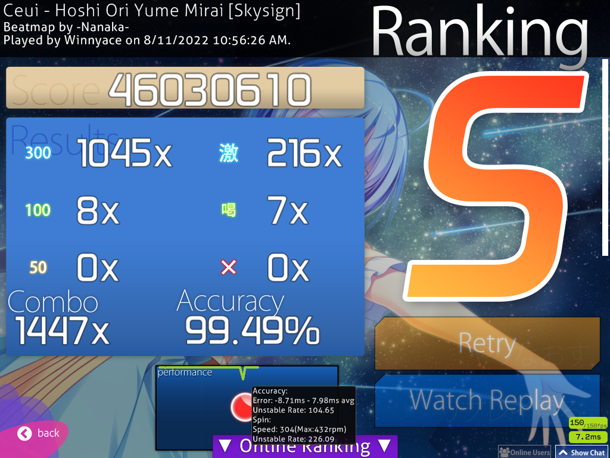

Hi! I kinda missed the mark, not gonna lie. I want from now on to post these weekly updates on Sunday. This week is missed, but next one, it will be from today to Sunday next week. I’ll try to keep my promise. Anyway, with that aside, this week was another mostly lazy one, but I got some pretty good scores. Let’s begin!

After my post from last week, I didn’t play until Thursday. That isn’t very good, but yeah… I started to play on Wednesday and I got two scores that I’m quite proud of. The first one is a slightly weird jump map, [Futari Dake no Kotoba](https://osu.ppy.sh/beatmapsets/962568#osu/2015483). I’m not sure if these jumps are called anti-jumps or not, but I think they’re.          

 

The second score is done on a more traditional map. I’m not sure if it is something very notable, though, so I’ll just put the score screenshot. 

 
Pardon the 4:3 resolution. how I play.

The next day, I got another score, on [Burnt Rice](https://osu.ppy.sh/beatmapsets/710329#osu/1502636).

 

On Saturday, I was away from home the whole day, and so I couldn’t play, but then on Sunday, I got a pretty nice score that I wanted for some time, [Koitsubakihime](https://osu.ppy.sh/beatmapsets/408558#osu/887145)

 

The accuracy could have been much better, if you ask me, but it’s still something.

Besides that, I’ve decided on a new goal: FC [Starting Forest by 3R2, the Insane difficulty](https://osu.ppy.sh/beatmapsets/909559#osu/1897995) with Flashlight. Yeah, Flashlight. I like Flashlight. If there is a mod that I dislike, it is Hidden, not only because I can’t play it, but because it is a very easy to spam. The amount of difficulty Hidden adds is negligible most of the time. It depends the map as well, but it depends a lot more on how familiar you’re with the mod. With a little practice, you can become just as good with HD as with NoMod. Now, Flashlight… Flashlight is also a visual mod, like Hidden, but with Flashlight, you’ve to be familiar with the map, rather than the mod. It’s a mod that challenges you to remember patterns and execute them with little visual clue and I find that very intriguing, which is why I want to get this score with Flashlight. I got some other Flashlight scores in the past, but this is the first one that passes 4 stars in difficulty. 

That Sunday, things were going pretty well with attempts andlearning the map. It’s quite an easy to retry spam the map due toits length, which is what I did for the most part that day. I also tried to split the map in parts to learn it, but I quickly dropped that approach  when I realize that, with Flashlight, the area around the cursor slowly shrinking with combo. This is the best score on the map that I got with Flashlight that day. 

 

On Tuesday, I continued my attempts and also played some other maps and I got two nice scores. The first one is on [Toumei Elegy](https://osu.ppy.sh/beatmapsets/219380#osu/555965).

 

The last score of that day was on [Ageage Again](https://osu.ppy.sh/beatmapsets/220694#osu/516452), with Hard Rock.

 

I'll talk more about my progress with the Flashlight score in the next week's post.

And with that, we reach today, late and overdue with this blog post… I’m sorry. I will try my best next week to post here on Sunday. I’ve a new blog post in the meantime coming up, hopefully this week, so stay tuned. See ya! 