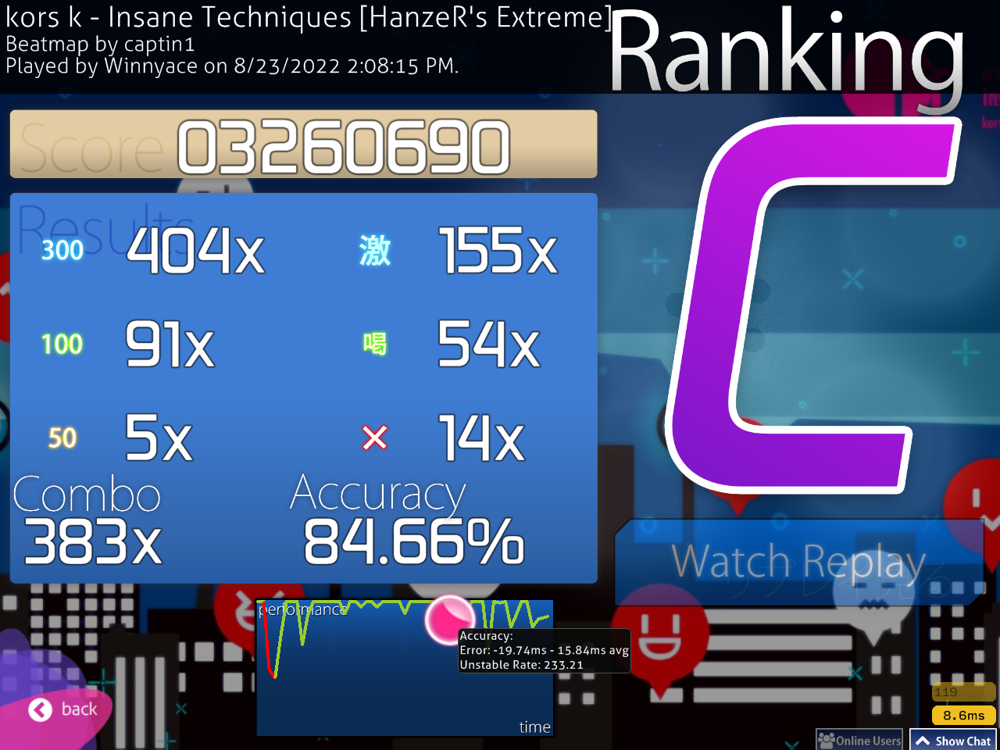

Hi! This week is a bit disappointing due to serval reasons, but I think it's time to do some retrospective and bring some news to this series.

I will present the scores, first off, in no chronological order. Spoiler alert: only 2 FCs this time. Most scores will be passes.

First up is a score that I wanted since [week 3&4](../osu_i_w_3_4/): Futari no Kimochi no Honto no Himitsu DT FC:



Remember that Flashlight score from [last week](../osu_i_w_5/)? Well, I got the FC!



Now, problem is that I was lazy this week. I can't lie to myself when I say that I didn't play as much as I wanted to and for as long, so as a result, the rest of these scores will be passes that I got on maps that I feel are important. The first one to start is on [Insane Techniques](https://osu.ppy.sh/beatmapsets/155288#osu/389703). 

The sliders on this map fuck me up hard, not gonna lie, but it's a fun map in my opinion.

Another fun map, or rather song, is [ENDLESS QUEER by Renard](https://osu.ppy.sh/beatmapsets/306028#osu/705091). The map is a screenjump fest. I enjoy it, though.

On the mods side, I got this pass on [Diamond](https://osu.ppy.sh/beatmapsets/111760#osu/290581) with HR. I'm hoping next week I will come with a FC on this since it's a pretty average map.

Back to NoMod, I got this almost FC on [Deep Sea](https://osu.ppy.sh/beatmapsets/104260#osu/274276)

I got a score on [FAKE PROMISE](https://osu.ppy.sh/beatmapsets/145978#osu/620789) with HR and NF on, so does it count as a pass? I don't know. I will put in away because I'm somewhat proud of it and it's a banging song, not gonna lie.

That's about it, to be honest. Not really pleased with the output this week. 

Now for some news related to this series. On the 5th of September, I'll start school, my last year of school. At the end of the year, I'm going to hold a very important exam here, the baccalaureate. This means that, next week, it is the last week of osu! improvement week, sadly. I'm not too sure what I will do this with this series, but I'm thinking of doing a monthly series instead. I will cover much more scores and I think it will be a better read than this weekly series. I want to keep playing osu! I don't want to stop just now. It's a fun game and it's deeply fulfilling as well, and so I want to keep going and balance things out. 

I still have one goal: FC [Asymmetry captin's Extra](https://osu.ppy.sh/beatmapsets/292077#osu/679779). I said that I want to get this score I think in week 2 and it's finally time. This last week it's going to be Asymmetry time. I'm gonna be like Azer getting his United score, or that's the plan anyway. Speaking of United, I want that score as well, but I first want Asymmetry. I hope I will get it and if I won't get it, well, shit happens and it's fine.

I hope to come back here next week with that score. See ya!