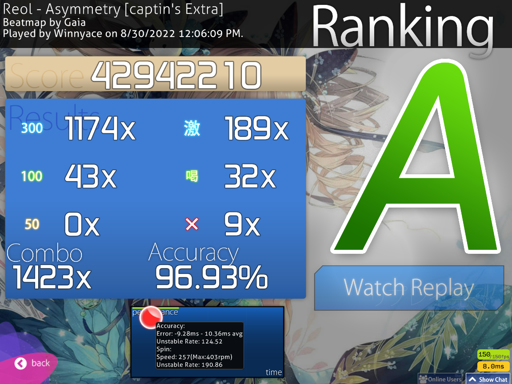

Hi! I come forward to you today with the sad news that I sadly didn't get the Asymmetry score this week. In fact, I'm unsatisfied with what I did this week, so I will have a retrospective around this whole thing instead for the end. It felt fitting. 

I should, however, at least post what I managed to get in terms of the score, which is a slight improvement over the previous score.

I did get other scores, but I'm not satisfied with them. I can't lie when I say that during this improvement series, I have been extremely lazy with my play sessions. I didn't try out as many new maps as I wanted and I think that hurt me. I was still lazy when it came to playing the game. A big reason why I've been this lazy is, I feel like, because of my 'all or nothing' mentality. I can't help but get more and more dissatisfied when I play and I keep failing to do what I set out to do. It's clear to me that this mindset isn't going to be good, long term. I simply have to fail to get good at this game. I can't be good if I don't suck first.

I think for September, I will try to understand what it means to enjoy the game and playing for the sake of enjoyment, becuase if I enjoy playing the game, failing to do something won't be a chore. I don't need to be the best at something to enjoy it. I also want to try lowering my expections for myself. I can't help but think that, while yes, I can get the Asymmetry score, perhaps I've aimmed slightly too high with this one. I can get it, but I need more time to refine my skills for that. The map is just slightly too much for my level. I need to shoot more close to reality with my skills.

I'm, however, happy I tried this. I got some decent to good scores out of this and I did something I wanted to do for a long time now, which is this blog. I honestly don't know who read these. I doubt anyone actually read them, fully. I can't help but think I'm, more or less, speaking into a void now, talking or rather writing for myself, but then, I don't think I should expect more than that. I'm glad, at least, I've this public record of my existance and that I managed to create this website. Even if nobody read these, I'm still happy I did this series and this blog as a whole, to be honest.

I will definitely keep coming here to do my stuff. For the moment, I don't plan to continue this weekly. I plan to talk about my progress when I feel like I've material for that. I want to talk about other things than osu! too, and I think I just got an idea while writing this sentence that will probably be interesting to talk about. I will see. Until then, see you next time. 