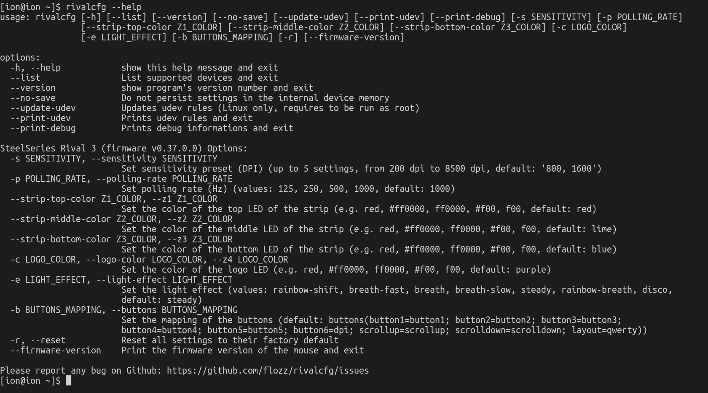

Hi! I've purchased recently a new mouse: a SteelSeries Rival 3. I had a Logitech G102 mouse before, but it sadly broke. Setting it up was a bit of a challenge, however. I want to show you today how to set it up using two programs: a CLI one for general configuration and a GUI one for the lighting on it.
I'm doing this post mainly as a reference for setting up most functions of the mice as of November 2022, using Linux native software. I'm not sure if the SteelSeries software thing works under Wine or not and to be honest I don't really want to try either. Most likely, in the future, this information will be out-of-date. **This isn't a review of the mice. This is just for setting it up for what I think is normal use.** If you want a super quick opinion on it, though, it is great and works very well. With all of that out of the way, let's get into setting this puppy up.

After you plugged in the mouse, under Linux, the way you configure this mouse's DPI, polling rate and lighting is through two pieces of software. Technically, you could use one of them, if you really want.

The first software I want to talk about is called [rivalcfg](https://flozz.github.io/rivalcfg/). It's a Python CLI app for setting up most functions of what seems to be most SteelSeries mice. [The Rival3 is supported, of course.](https://flozz.github.io/rivalcfg/devices/rival3.html) [Check the installation guide for your distro.](https://flozz.github.io/rivalcfg/install.html)

After installing, you can type `rivalcfg --help` to see what the software detects. For me, the software detected the mouse right away.

Getting something like this on the screen means you're good.

Now, **to change the DPI of the mouse,** we use the `--sensitivity` or `-s` flag alongside an integer that ranges, for the Rival 3, between 200 and 8500. This number represent the DPI value you want to set the mouse at. So, for example, if I want to set the mouse to 1000 DPI, we would write in the console

`rivalcfg --sensitivity 1000` or `rivalcfg -s 1000`.

If I want to set the mouse to 800 DPI, we do

`rivalcfg --sensitivity 800`/`rivalcfg -s 800`

**To change the mouse's polling rate,** we use the `--polling-rate` or `-p` flag alongside the values that we want from the next list: 125, 250, 500, 1000. I'd personally just set the mouse to the highest polling rate, so

`rivalcfg --polling-rate 1000` or `rivalcfg -p 1000`.

If you have any issue, you could try to set it down and see what it does.

**To set the lighting for the mouse,** you could use this program, but note that the program takes hex color values, so the colors it knows are written like #c3005b, and not 'redish pink'. If you want to completely disable the RGB lighting, the following commands will do that:

`rivalcfg --c 000000`

`rivalcfg --z1 000000`

`rivalcfg --z2 000000`

`rivalcfg --z3 000000`

This will set the LEDs to show the color black, so it will turn the LEDs off.

If you want to set specific colors to different regions, I would say that this utility doesn't really work well for it. You can use its documentation and help screen if you want to do that. I don't like using it for that purpose and so I won't show it here, but I will tell you about a piece of software I didn't knew until a few days ago: [OpenRGB](https://openrgb.org/).

OpenRGB is a open source RGB setting program. It works for much more than just mice, but we'll use it for setting up the Rival 3's lighting. For Linux, there are a lot of ways you could install this app. There's an AUR package, for those on Arch, deb packages for those on Debian based distros, it even has an AppImage release. [Check the downloads for the software here.](https://openrgb.org/#downloads)

After downloading the software, the software should see the mouse immediately.

This program is really easy and allows you to control the lights of the mouse much like how the SteelSeries software would. For example, you can easily choose what areas of the mouse are lit. I like having only the logo be lit in a dim light blue color, so I select the 'logo' option from the zone menu, select a light blue color from the color wheel next to the menus hit 'Save To Device' below the color wheel and information and voila, I'm done! I'd show a photo of it, but the camera really doesn't show how dim the light is and I don't know how to make it be more dim, so I'm sorry about that.

You can pick different regions and different effects, but I will let you discover that.

That's it. I hope I was able to help. See ya!
